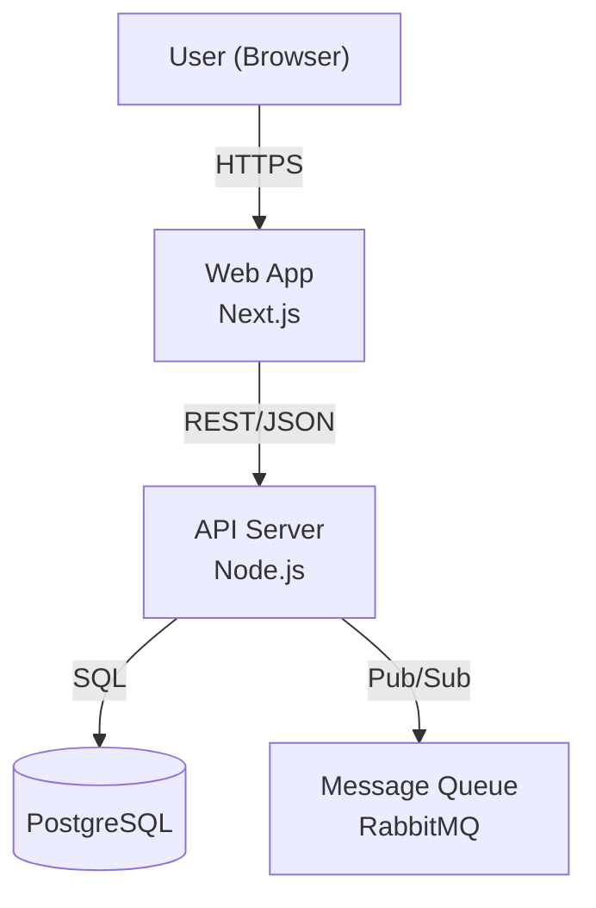

# Implementation Examples

## C4 Container Diagram (Mermaid)

```mermaid
graph TD
    User["User (Browser)"] -->|HTTPS| WebApp["Web App<br/>Next.js"]
    WebApp -->|REST/JSON| API["API Server<br/>Node.js"]
    API -->|SQL| DB[("PostgreSQL")]
    API -->|Pub/Sub| Queue["Message Queue<br/>RabbitMQ"]
```
