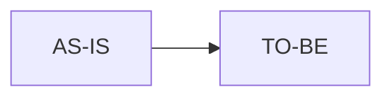

# Business Requirements Document (BRD-lite): [Initiative Name]

**Status**: Draft | **Owner**: [Name] | **Last Updated**: [YYYY-MM-DD]

## 1. Executive Summary

- **Purpose**: [why this initiative exists]
- **Desired Outcome**: [business outcome]
- **Sponsor**: [name/team]
- **Validation Owner**: [name/team]

## 2. Business Objective

- **Objective ID**: BRD-OBJ-001
- **Objective Statement**: [Outcome]
- **Baseline**: [Current state metric]
- **Target**: [Target metric + date]
- **Owner**: [Owner]
- **SMART Check**: [specific/measurable/achievable/relevant/time-bound]

## 3. Current State (AS-IS)

- [Current workflow and pain points]

## 4. Future State (TO-BE)

- [Desired operational state]

## 5. Process Diagram (Optional)

## 6. Stakeholders

| Stakeholder | Role | Impact | Approval Needed |
| --- | --- | --- | --- |
| [name/team] | [role] | [impact] | [yes/no] |

## 7. Scope And Boundaries

- **In Scope**: [items]
- **Out of Scope**: [items]
- **Assumptions**: [items]
- **Constraints**: [items]

## 8. Business Value

- **Value Type**: [cost/revenue/risk/compliance]
- **Expected Benefit**: [quantified where possible]
- **Cost / Tradeoff**: [budget/time/operational cost]

## 9. Risks

| Risk | Impact | Mitigation | Owner |
| --- | --- | --- | --- |
| [risk] | [impact] | [mitigation] | [owner] |

## 10. Glossary

| Term | Meaning | Owner |
| --- | --- | --- |
| [term] | [definition] | [owner] |

## 11. PRD Hand-off Notes

- Candidate PRD requirement links: [REQ-001], [REQ-002]
- Open decisions for PRD: [items]
